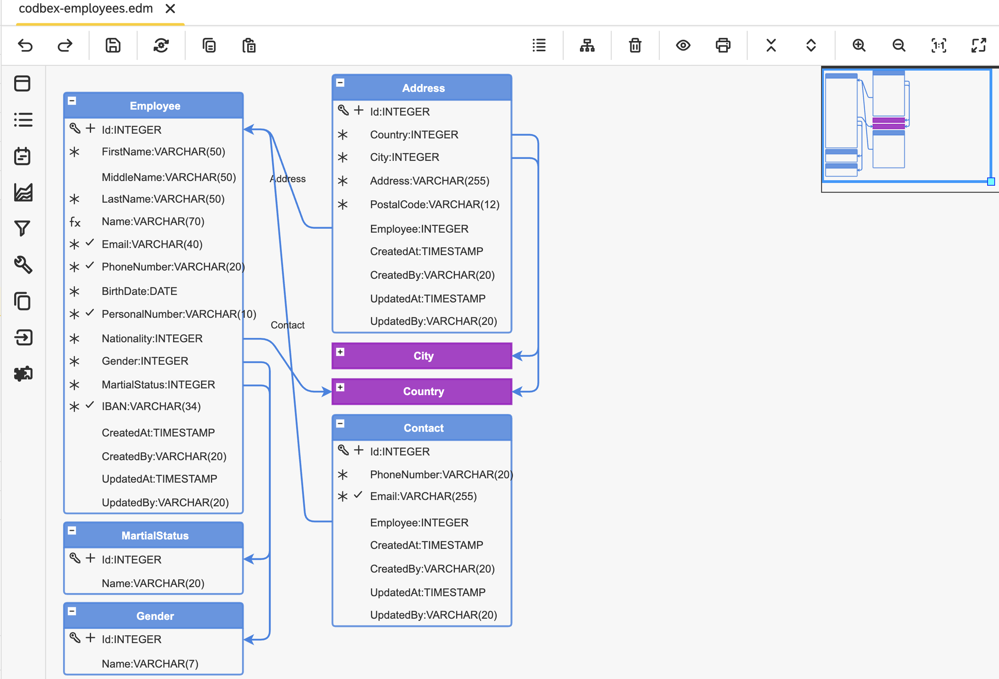

#  codbex-employees

## 📖 Table of Contents
* [🗺️ Entity Data Model (EDM)](#️-entity-data-model-edm)
* [🧩 Core Entities](#-core-entities)
* [📦 Dependencies](#-dependencies)
* [🔗 Sample Data Modules](#-sample-data-modules)
* [🐳 Local Development with Docker](#-local-development-with-docker)

## 🗺️ Entity Data Model (EDM)



## 🧩 Core Entities

### Entity: `Employee`

| Field          | Type      | Details                    | Description                        |
|----------------| --------- | -------------------------- | ---------------------------------- |
| Id             | INTEGER   | PK, Identity       | Unique identifier for the employee |
| FirstName      | VARCHAR   | Length: 50, Not Null       | First name of the employee         |
| MiddleName     | VARCHAR   | Length: 50, Nullable       | Middle name of the employee        |
| LastName       | VARCHAR   | Length: 50, Not Null       | Last name of the employee          |
| Name           | VARCHAR   | Calculated, Length: 70, Nullable       | Full name of the employee          |
| Email          | VARCHAR   | Length: 40, Unique, Not Null | Email address of the employee      |
| PhoneNumber    | VARCHAR   | Length: 20, Unique, Not Null | Phone number of the employee       |
| BirthDate      | DATE      | Not Null                   | Birthdate of the employee          |
| PersonalNumber | VARCHAR   | Length: 10, Unique, Not Null | Personal identification number     |
| Nationality    | INTEGER   | Not Null, FK               | References country                 |
| Gender         | INTEGER   | Not Null, FK               | References gender                  |
| MaritalStatus  | INTEGER   | Not Null, FK               | References marital status          |
| IBAN           | VARCHAR   | Length: 34, Unique, Not Null | IBAN of the employee               |
| CreatedAt      | TIMESTAMP | Nullable                   | Creation timestamp                 |
| CreatedBy      | VARCHAR   | Length: 20, Nullable       | Created by user                    |
| UpdatedAt      | TIMESTAMP | Nullable                   | Last update timestamp              |
| UpdatedBy      | VARCHAR   | Length: 20, Nullable       | Updated by user                    |

### Entity: `Gender`

| Field | Type    | Details                | Description                  |
| ----- | ------- | ---------------------- | ---------------------------- |
| Id    | INTEGER | PK, Identity, Nullable | Unique identifier for gender |
| Name  | VARCHAR | Length: 7, Nullable    | Name of the gender           |

### Entity: `MartialStatus`

| Field | Type    | Details                | Description                          |
| ----- | ------- | ---------------------- | ------------------------------------ |
| Id    | INTEGER | PK, Identity, Nullable | Unique identifier for marital status |
| Name  | VARCHAR | Length: 20, Nullable   | Name of the marital status           |

### Entity: `Contact`

| Field       | Type      | Details                       | Description                   |
| ----------- | --------- | ----------------------------- | ----------------------------- |
| Id          | INTEGER   | PK, Identity, Nullable        | Unique identifier for contact |
| PhoneNumber | VARCHAR   | Length: 20, Not Null          | Contact phone number          |
| Email       | VARCHAR   | Length: 255, Unique, Not Null | Contact email                 |
| Employee    | INTEGER   | Nullable, FK                  | References employee           |
| CreatedAt   | TIMESTAMP | Nullable                      | Creation timestamp            |
| CreatedBy   | VARCHAR   | Length: 20, Nullable          | Created by user               |
| UpdatedAt   | TIMESTAMP | Nullable                      | Last update timestamp         |
| UpdatedBy   | VARCHAR   | Length: 20, Nullable          | Updated by user               |

### Entity: `Address`

| Field      | Type      | Details                | Description                   |
| ---------- | --------- | ---------------------- | ----------------------------- |
| Id         | INTEGER   | PK, Identity, Nullable | Unique identifier for address |
| Country    | INTEGER   | Not Null, FK           | References country            |
| City       | INTEGER   | Not Null, FK           | References city               |
| Address    | VARCHAR   | Length: 255, Not Null  | Street address                |
| PostalCode | VARCHAR   | Length: 12, Not Null   | Postal code                   |
| Employee   | INTEGER   | Nullable, FK           | References employee           |
| CreatedAt  | TIMESTAMP | Nullable               | Creation timestamp            |
| CreatedBy  | VARCHAR   | Length: 20, Nullable   | Created by user               |
| UpdatedAt  | TIMESTAMP | Nullable               | Last update timestamp         |
| UpdatedBy  | VARCHAR   | Length: 20, Nullable   | Updated by user               |


## 📦 Dependencies

- [codbex-countries](https://github.com/codbex/codbex-countries)
- [codbex-cities](https://github.com/codbex/codbex-cities)
- [codbex-navigation-groups](https://github.com/codbex/codbex-navigation-groups)

## 🔗 Sample Data Modules

- [codbex-employees-data](https://github.com/codbex/codbex-employees-data)

## 🐳 Local Development with Docker

When running this project inside the codbex Atlas Docker image, you must provide authentication for installing dependencies from GitHub Packages.
1. Create a GitHub Personal Access Token (PAT) with `read:packages` scope.
2. Pass `NPM_TOKEN` to the Docker container:

    ```
    docker run \
    -e NPM_TOKEN=<your_github_token> \
    --rm -p 80:80 \
    ghcr.io/codbex/codbex-atlas:latest
    ```

⚠️ **Notes**
- The `NPM_TOKEN` must be available at container runtime.
- This is required even for public packages hosted on GitHub Packages.
- Never bake the token into the Docker image or commit it to source control.
